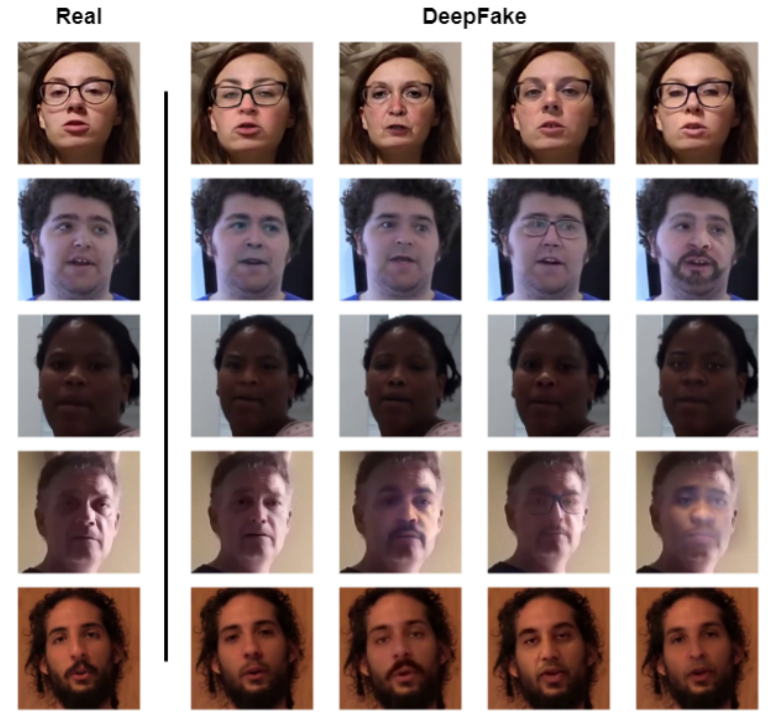
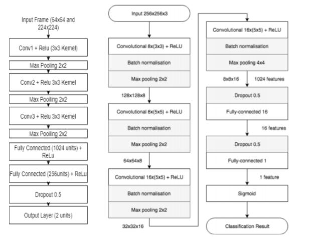
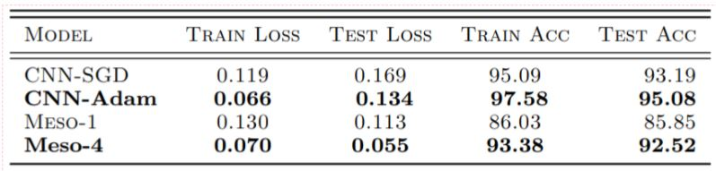
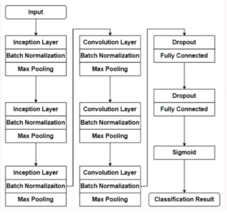

# Deep-Fake-Detection
Detecting whether the Video is Fake or not with the help of Deep Learning Techniques. 
This Project is done as a part of Deep Learning Course hence No Pretrained Neural Network is used. 
This Repository contains 4 Folders :  
1. **Baselines** : It contains our Baselines Model i.e Implementation of CNN and MesoNet-1 and MesoNet-4 Architecture. 
2. **Our Model** : It contains our Final Model i.e. Implementation of InceptionConv .
3. **Presentation** : Presentation for Deep Fake Detection.
4. **Report** : It contains Two Reports Baseline Report and Final Report.

## Dataset
We have used DFDC Kaggle Dataset which contains More than 100,000 Videos, Featuring eight facial modification algorithms in which  Actors were Paid to create Deep Fake Videos,dataset was Divided into 50 Batches.

For Baselines Implementations : (https://arxiv.org/abs/1809.00888)
## Baseline Architecture : **CNN** (Left) **MesoNet** (Right)

## Baseline Results :

## Baseline Limitations/Assumptions :
1. Due to computational bottleneck, baseline was performed on a single batch ‘’dfdc_train-part_13.zip’’
2. Furthermore 3 Parts were taken from Batch ‘’dfdc_train-part_13.zip’’.
3. Key Observations : High Correlation among data as it was created by few actors.
4. Biased Model : Model was Biased towards the Data 
5. Class Imbalance : More number of Fake Videos as compared to real Videos.

## Final Architecture : InceptionConv

## Conclusion
Facebook reported Highest Accuracy on whole Dataset : **82%**  
Kaggle Winner  Profile : (https://www.kaggle.com/selimsef)  
(Pretrained Encoder Models were used like EfficientNet b7, trained on 4 GPU’s, 2500 iteration per epoch)   
We were able to achieve 80% Accuracy on DFDC Dataset (5000 Videos with equal distribution of Fake and Real Videos)
We might Achieve more accuracy if Provided GPU Processing On whole Dataset of 124k videos.  
**Note : No Pretrained Model is used in this Project**

### Team Members :
Prabal Jain (MT20115)
Pruthivi Raj Behera (MT20037)
TG Narayanan (MT20027)
